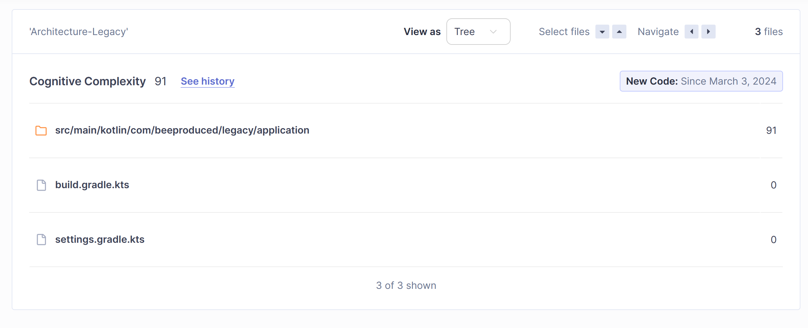

# Architecture Evaluation

Two example project were created to compare architectural evaluation.

The `legacy` project is based on older guidelines which were used while adopting GraphQL at first.

The `proposal` project features the streamlined architecture as mentioned in the thesis with a package-by-feature approach and custom libraries to streamline boilerplate code.

---

Although the projects use the same GraphQL schema and demonstrate the same use-case, the legacy approach is more restricted in terms of features.

For example, dynamic queries due to GraphQL client requests are much more restricted, mostly only allowing changes on the root object and not further. Also the depth is pre-defined as even more code would be required to make nested queries even possible.

Also, the legacy codebase features both model and dao objects in order to separate immutable business logic from the mutable JPA world. The proposal project features only immutable model classes as `bee.persistent` makes them work even with JPA.

The legacy project only features a page-based pagination whereas the proposal features a much more comfortable cursor-based pagination. 

Also, the legacy project uses no data loaders, instead this feature is mimicked at the business logic level which makes it a lot less flexible.

---

## Measures

### Legacy





### Proposal


---

```bash
docker run -d --name sonarqube -e SONAR_ES_BOOTSTRAP_CHECKS_DISABLE=true -p 9000:9000 sonarqube:latest
```

```
eval eval
```

```bat
./gradlew sonar "-Dsonar.projectKey=architecture-proposal" "-Dsonar.projectName='Architecture-Proposal'" "-Dsonar.host.url=http://localhost:9000" "-Dsonar.token=sqp_755b49a36ecfac80f891f9809c2ad7051b8a12c3"
```

```bash
./gradlew sonar "-Dsonar.projectKey=architecture-legacy" "-Dsonar.projectName='Architecture-Legacy'" "-Dsonar.host.url=http://localhost:9000" "-Dsonar.token=sqp_ba961fe7730da59984845ccb641a538e7c7b91ec"
```

